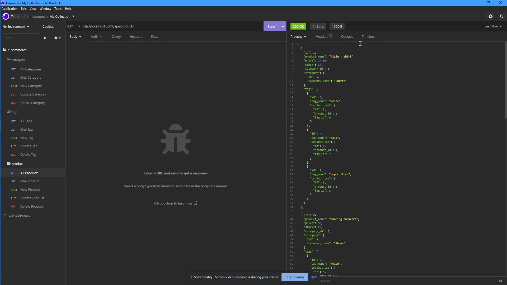

# E-Commerce

## Description

A back end application that connects an e-commerce database with a server to allow a front end to access the database and update it.

## Installation

1. Download the files
2. From the command line in the same folder as index.js run the following:
   - npm install Sequelize mysql2 express
3. In order to use the schema for the database you will need to have a mysql login and login into it from the command line

## Usage

Run the application from the command line in the folder index.js is in. Run it with the command: npm start.

## Screenshot

## Tutorial Video

## Built With

- JavaScript
- SQL
- NodeJS
- express.js
- mysql2
- Sequelize

## Questions

If you have any questions, please contact at [GitHub/JonathanGibbings](https://github.com/JonathanGibbings/).
